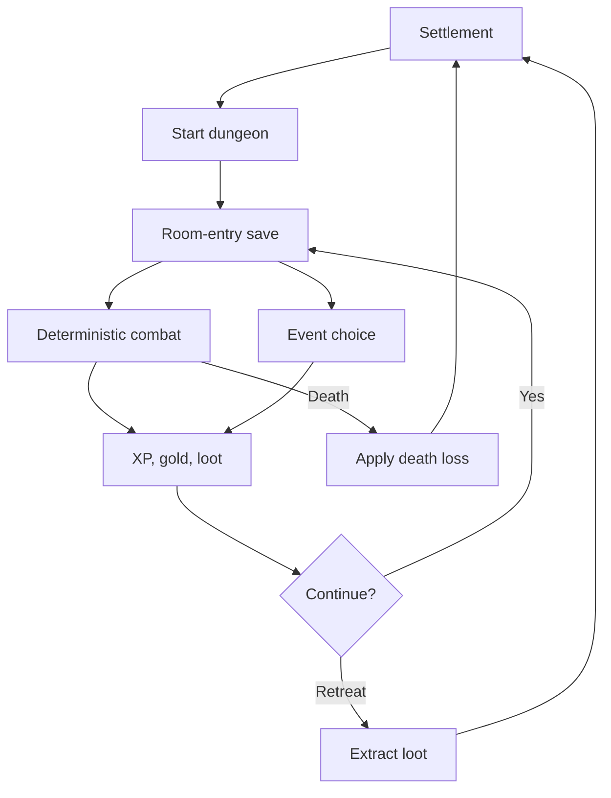

# Architecture

## Runtime

- React renders the interface and coordinates stable game-state transitions.
- TypeScript modules in `src/game/` form the authoritative simulation engine.
- Vite creates a static production bundle.
- Browser local storage holds the versioned save; JSON export/import provides portability.
- Vitest verifies formulas and deterministic simulations.

No server is required.

## Module boundaries

| Module | Responsibility |
|---|---|
| `types.ts` | Persisted and runtime type contracts |
| `rules.ts` | Pure formulas and derived statistics |
| `rng.ts` | Seeded pseudo-random number generation |
| `content-loader.ts` and `data/` | JSON catalog validation, stable IDs, reference checks, and resolved definitions |
| `content.ts` | Resolve starter item instances and level-scaled encounters from the catalog |
| `loot.ts` | Rarity tables and item generation |
| `combat.ts` | Combat initialization, ticking, actions, and outcomes |
| `state.ts` | New game, leveling, expedition start, and save/load |
| `migrations.ts` | Shared save parsing, strict validation, serialization, and sequential version migrations |
| `simulator.ts` | Seeded, pure dungeon runs and aggregate balance measurements using production engine rules |
| `events.ts` | Typed, transient game-event bus and optional audio adapter |
| `App.tsx` | UI orchestration and stable-boundary transitions |

## State flow

## Save policy

The save owns player decisions and durable progress. Combat is deliberately transient. During a fight, the most recent stable save is the room-entry state; closing the browser restarts that room.

As the model grows, add `src/game/migrations.ts` and migrate sequentially from each earlier integer version. Never mutate or infer an old save silently inside React components.

Milestone 2 adds that migration boundary without changing the current durable schema. Browser loads, autosave serialization, JSON export, and JSON import all pass through `migrations.ts`. Version 1 is validated and copied losslessly; unsupported future versions and malformed fields are rejected with a path-specific reason. When version 2 is eventually required, add a pure `v1 -> v2` migrator to the ordered migration table before changing the current-version constant.

## Content migration

Milestone 2 stores starter items, monsters, skills, Greenwood rooms, and events in separate JSON collections. `data/catalog.schema.json` documents their JSON Schema shape; `content-loader.ts` enforces the corresponding runtime contracts plus unique IDs and cross-collection references before gameplay. Affix and legendary collections are empty until their gameplay milestones. Existing item instances and room kinds in v1 saves are unchanged.
